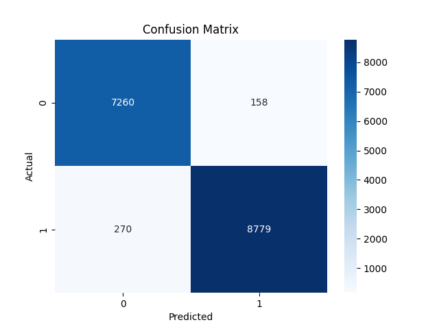
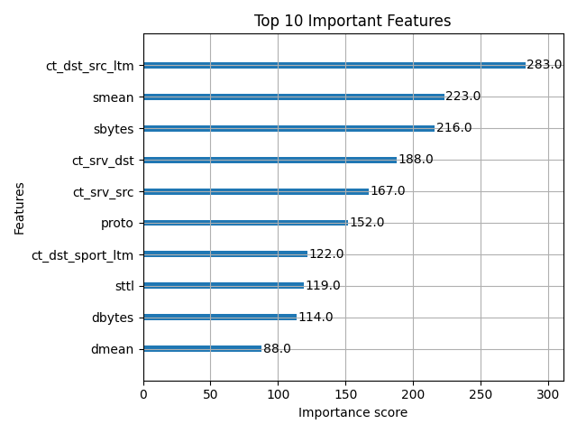

# AI-Powered Cybersecurity Threat Detection Dashboard

A modern, end-to-end AI system for real-time network intrusion detection, explainable AI (XAI), and reinforcement learning-based threat response. Built with Python, XGBoost, SHAP, Flask, and more.

---

## 🚀 Features
- **Live Dashboard**: Real-time monitoring of network traffic and threats
- **AI Models**: Binary and multi-class attack detection using XGBoost
- **Explainable AI**: SHAP-based visual explanations for model predictions
- **Reinforcement Learning**: DQN agent for automated threat response
- **Interactive Visualizations**: Confusion matrices, feature importance, and more

---

## 📁 Project Structure
```
├── dashboard/         # Flask app, static assets, templates
├── data/              # Datasets (UNSW-NB15)
├── model/             # Saved models and encoders
├── notebooks/         # Jupyter notebooks for model training
├── packet_capture/    # Live packet sniffer and preprocessor
├── reports/           # Evaluation reports and visualizations
├── rl_agent/          # Reinforcement learning agent code
├── xai/               # SHAP explainer for XAI
├── main.py            # Project automation script
├── requirements.txt   # Python dependencies
```

---

## ⚡ Quickstart

### 1. Requirements
- **Python 3.11.x** (not 3.12+)
- Windows or Linux

### 2. Setup & Run (One Command)
```bash
python main.py
```
- Checks Python version
- Creates virtual environment (if needed)
- Installs dependencies
- Runs the main notebook to train models (if needed)
- Launches the dashboard at [http://localhost:5000](http://localhost:5000)

---

## 📊 Model Training & Notebooks
- Main notebook: `notebooks/model_training_and_evaluation.ipynb`
- Trains both binary and multi-class XGBoost models
- Saves models to `model/` folder
- Generates evaluation reports and visualizations in `reports/`

---

## 🛡️ Dashboard Features
- Live stream of simulated or real network traffic
- Attack/benign and attack category predictions
- SHAP explanations for individual packets
- Visual analytics: confusion matrix, feature importance, F1-scores

---

## 📦 Data
- Uses the [UNSW-NB15 dataset](https://www.unsw.adfa.edu.au/unsw-canberra-cyber/cybersecurity/ADFA-NB15-Datasets/)
- Place CSV files in the `data/` folder

## 📈 Report Visualizations

Below are examples of the visual outputs generated by the project:

### Confusion Matrix


### Feature Importance


All visualizations are saved in the `reports/visualizations/` folder after running the notebook.

---

## 🛠️ Troubleshooting
- **Python 3.12+ not supported**: Use Python 3.11.x
- **Missing models?**: The notebook will auto-run to generate them
- **Dashboard not starting?**: Check for errors in the terminal and ensure all dependencies are installed

---

## 🤝 Contributing
Pull requests and issues are welcome! See `CONTRIBUTING.md` for guidelines (optional).

---

## 📄 License
MIT License (or your choice)

---

## 🙏 Acknowledgements
- [UNSW-NB15 Dataset](https://www.unsw.adfa.edu.au/unsw-canberra-cyber/cybersecurity/ADFA-NB15-Datasets/)
- XGBoost, Flask, SHAP, Scapy, and the open-source community

---

